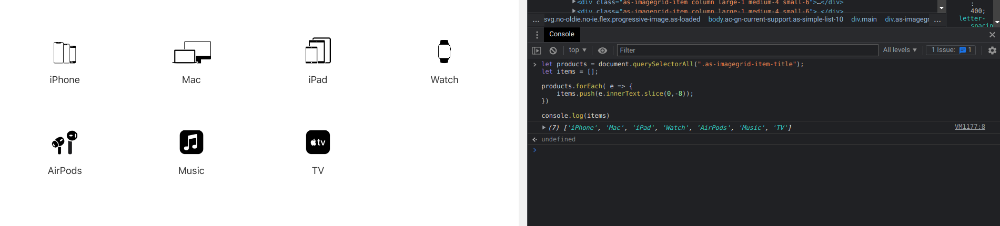
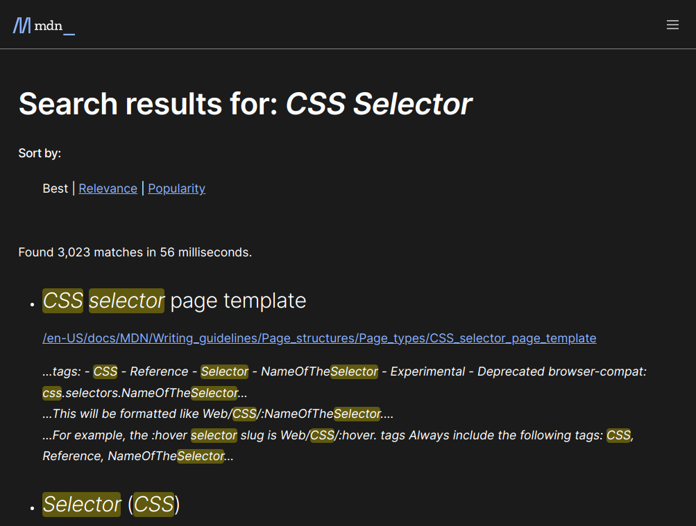

# DOM Assignments

## 1. Webiste Name: [Dev To](https://dev.to/)

### Topics

> Query Selctor, Inner HTML

```JS
let card = document.querySelector("aside > .crayons-card");

card.querySelector("h2").innerHTML = "mohanverse";

card.querySelector("p").innerHTML = "I am a Web Developer";
```


.png)

## 2. Website Name: [Apple](https://support.apple.com/en-in)

**Task**

> Fetch all the product name and store in an array

```JS
let products = document.querySelectorAll(".as-imagegrid-item-title");
let items = [];

products.forEach( e => {
    items.push(e.innerText.slice(0,-8));
})

console.log(items)
```



## 3. Webiste Name: [Youtube Support](https://support.google.com/youtube/)

### Topics

> Get Element By Id, Create Element, Create Text Node, Append Child

```JS
let accordion = document.querySelector(".accordion-homepage");
let faq = document.createElement("section");
faq.classList.add("parent");
faq.innerHTML = `<h3>My new FAQ</h3>`;
accordion.appendChild(faq);
```

.png)

## 4. Webiste Name: [OnePlus](https://www.oneplus.in/support)

### Topics

> Query Selector, InnerText

```JS
let contact = document.querySelector(".service-number");
contact.innerText = "+91 9097190197";
contact.style.color ="Blue";
```


## 5. Webiste Name: [Samsung](https://www.samsung.com/in/offer/online/samsung-fest/)

### Topics

> getElementById, createElement, InnerText, append, setAttribute

### Tasks

- Target the main div of card and change the Button text to Check out

```JS
let card = document.querySelectorAll(".feature-column-carousel__feature")[0];

card.querySelector(".cta").innerText = "Check out";
```


## 6. Webiste Name: [Adidas](https://www.adidas.co.in/)

### Topics

> Query Selector, Event listeners, Changing Styles

### Tasks

- Target the search box and on hover change thebackground color to red.

```JS
let search = document.querySelector('[aria-label="Search"]');

search.addEventListener('mouseover', () => {
    search.style.backgroundColor = "Red";
})

search.addEventListener('mouseout', () => {
    search.style.backgroundColor = "white";
})
```

.png)

## 7. Webiste Name: [MDN Web Docs](https://developer.mozilla.org/en-US/)

### Topics

> Form, Value, Submit

```JS
let form = document.getElementById("hp-search-form");

form.querySelector("input").value = "CSS Selector";

form.submit();
```


# DOM_asighment
